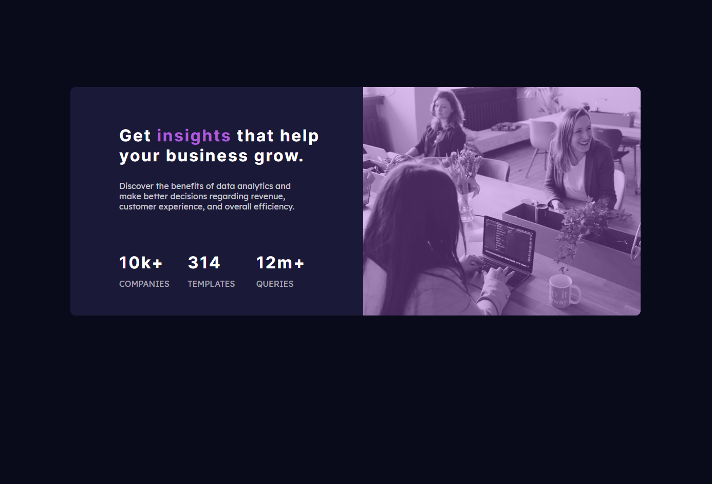
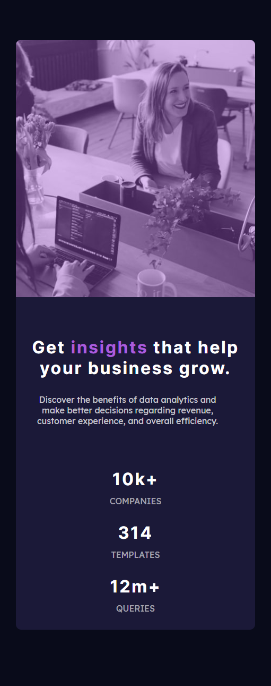

# Frontend Mentor - Stats preview card component solution

This is a solution to the [Stats preview card component challenge on Frontend Mentor](https://www.frontendmentor.io/challenges/stats-preview-card-component-8JqbgoU62). Frontend Mentor challenges help you improve your coding skills by building realistic projects. 

## Table of contents

- [Overview](#overview)
  - [The challenge](#the-challenge)
  - [Screenshot Desktop Version](#screenshot-desktop-version)
  - [Screenshot Mobile Version](#screenshot-mobile-version)
  - [Links](#links)
- [My process](#my-process)
  - [Built with](#built-with)
  - [What I learned](#what-i-learned)
- [Author](#author)

## Overview

### The challenge

Users should be able to:

- View the optimal layout depending on their device's screen size

### Screenshot Desktop version

### Screenshot Mobile version

### Links

- Live Site URL: [Live Site deployed with Netlify](https://agitated-lamport-c049c2.netlify.app/)

## My process

### Built with

- Semantic HTML5 markup
- SCSS custom properties
- Flexbox
- CSS Grid
- Mobile-first workflow

### What I learned

It took me a full day to develop this. My major obstacle was to create responsive design.
I took this challenge to confront myself with where I am standing currently with my design skills. I learned that I have a lot to learn to become more effective at writing SCSS.
Still have problems understanding the Flexbox properties, media queries and mixins.

## Author

- Frontend Mentor - [@peirstom](https://www.frontendmentor.io/profile/peirstom)
- Twitter - [@tompeirs](https://www.twitter.com/tompeirs)

